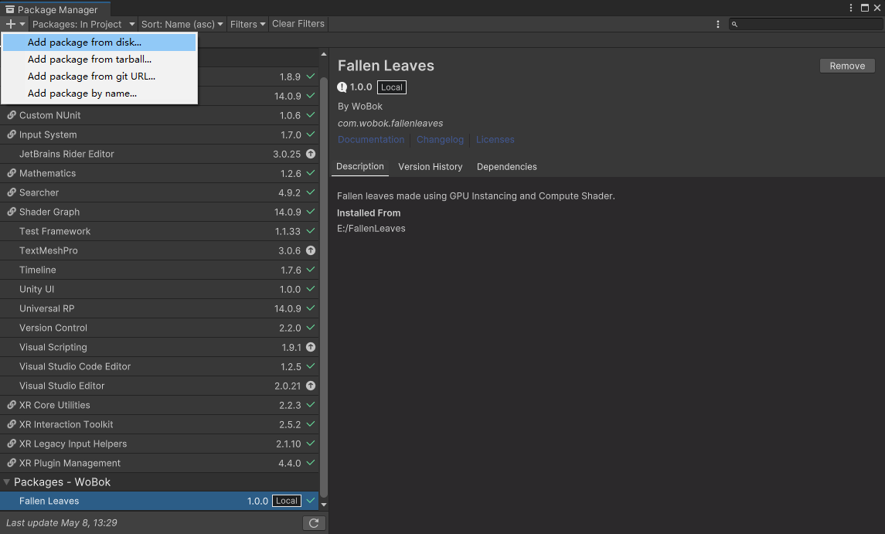
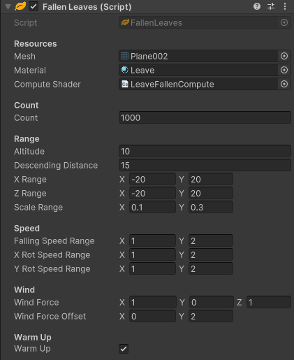

# Preview

# 安装
**Step 1**  
  
选择菜单Window→Package Manager  

**Step 2**  
  
选择Add package from disk...  

**Step 3**  
  
选择package.json

# 使用
  
**Resources**  
Mesh：需要绘制的网格  
Material：绘制网格用到的材质，材质必须使用包内Runtime/Shaders路径下的FallenLeaves.shader  
Compute Shader：计算落叶用到的Compute Shader，需使用包内位于Runtime/Shaders路径下的LeaveFallenCompute.compute  

**Count**  
Count：落叶的总数量

**Range**  
Altitude：落叶起始位置的高度，如从10米的空中落下  
Descending Distance：落叶下落的距离，如从10米空中下降15米  
X Range：落叶在X轴方向上的生成范围  
Z Range：落叶在Z轴方向上生成的范围  
Scale Range：落叶缩放的范围，随机生成范围内大小的落叶  

**Speed**  
Falling Speed Range：落叶下落速度的范围，随机生成范围内的下落速度  
X Rot Speed Range：落叶在X轴上的旋转速度范围，随机生成范围内沿X轴旋转的速度  
Y Rot Speed Range：落叶在Y轴上的旋转速度范围，随机生成范围内沿Y轴旋转的速度  

**Wind**  
Wind Force：风的方向与风力，数值越大，风力越大  
Wind Force Offset：增加风对落叶的随机影响，表现为树叶被吹动的速度不同  

**Warm Up**  
Warm Up：是否预先生成落叶在Y轴方向的位置，如果不勾选，则树叶从Altitude（落叶的起始高度）开始下落，如果勾选，则预先生成Y轴方向的位置，提前进入循环  

不使用Warm Up：  
  
使用Warm Up：  
